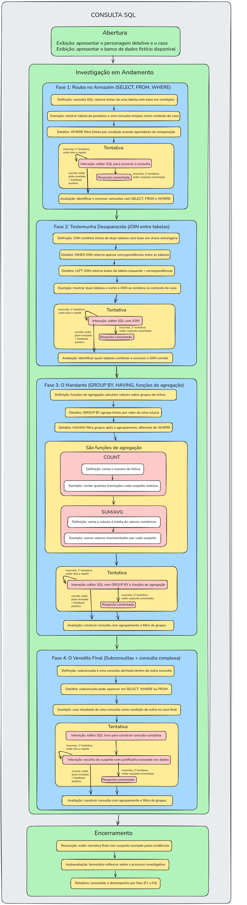

# detetiveSQL
Projeto da disciplina de Objetos de Aprendizagem

## Público-Alvo
Este objeto de aprendizagem é destinado a estudantes jovens (ensino médio e início do ensino superior)

## Mapa Conceitual
Acesse o mapa conceitual do projeto para visualizar a estrutura e os conceitos envolvidos: [Mapa Conceitual](https://cmapscloud.ihmc.us/viewer/cmap/22NYLDRG0-2DKBHS1-MQPG10)

## Requisitos de Aprendizagem

| # | Objetivo | Nível Bloom | Avaliação no Jogo |
|---|----------|-------------|-------------------|
| 1 | Compreender conceitos fundamentais de banco de dados | **Entender** | Questionários conceituais para acesso às evidências |
| 2 | Aplicar consultas SQL para investigação | **Aplicar** | Execução de consultas SQL para obter pistas |
| 3 | Analisar dados para identificar padrões e inconsistências | **Analisar** | Comparação de dados entre tabelas |
| 4 | Avaliar hipóteses com base em evidências | **Avaliar** | Escolha do suspeito com justificativa |
| 5 | Criar consultas e soluções para resolver o caso | **Criar** | Construção de consultas completas |

## Modelo Instrucional

